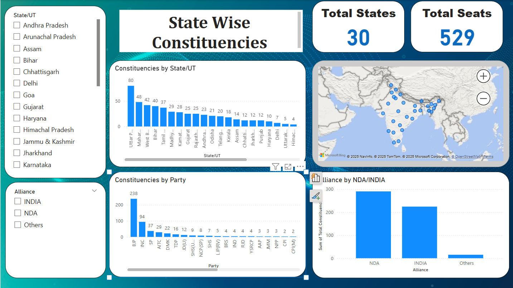
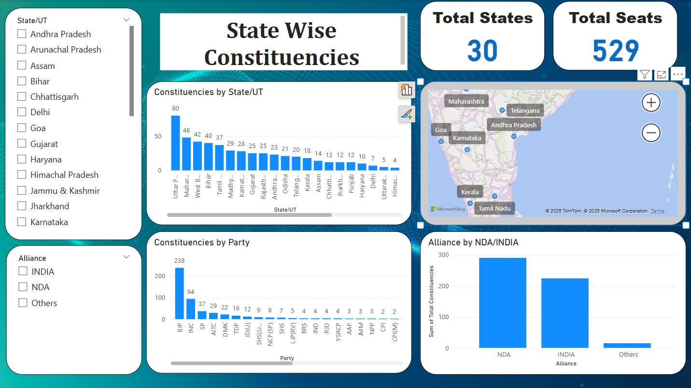
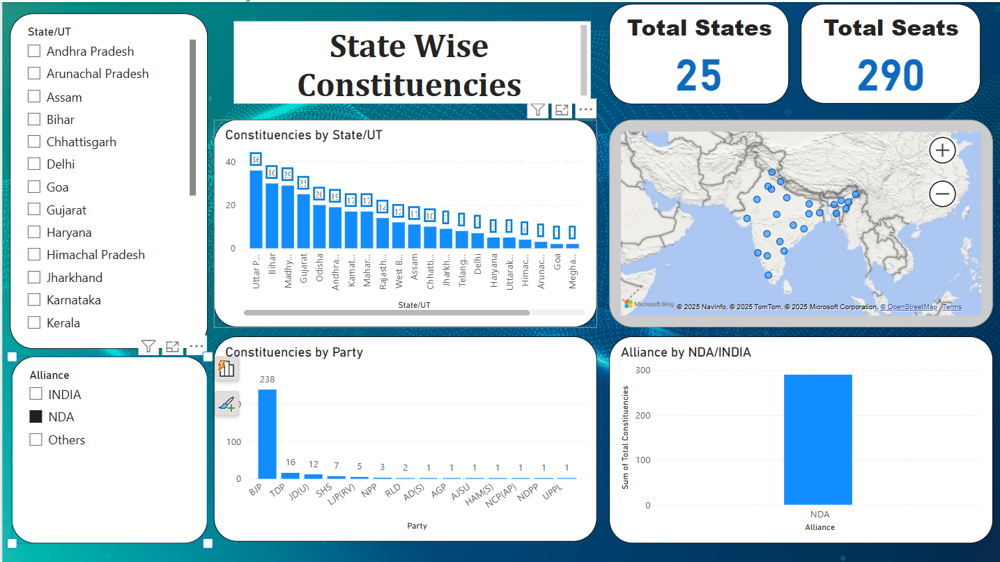

# 🗳️ Indian Election Constituency Dashboard (Power BI)

This interactive dashboard visualizes the division of Indian parliamentary constituencies among different political parties and alliances (NDA, INDIA, Others) during the elections.

## 📌 Features

- Constituencies grouped by **State/UT**
- Seats divided by **Party**
- Alliance-wise seat split (NDA, INDIA, Others)
- Interactive filters for state and alliance selection
- Map visualization for geo-located constituency insights
- Summary indicators (Total States, Total Seats)

## 🛠️ Tools Used

- **Power BI Desktop**
- Data visualization using bar charts, maps, and filters
- Data modeling and DAX for measures and aggregation

## 🎯 Learnings

This project helped me explore:
- Power BI’s data transformation and modeling capabilities
- Designing intuitive dashboards for analytical storytelling
- Extracting actionable insights from electoral datasets

## 📸 Preview

_Screenshot of the dashboard interface:_

---

## 📁 Project Files

- `PowerBI_Election_Dashboard.pbix` – The Power BI project file
-  Screenshots and media used in documentation

---

## 📬 Contact

Feel free to connect with me on [LinkedIn]([https://www.linkedin.com/](https://www.linkedin.com/in/balasubramanian-m-9222a225a/)) or raise an issue if you have questions about this project.

